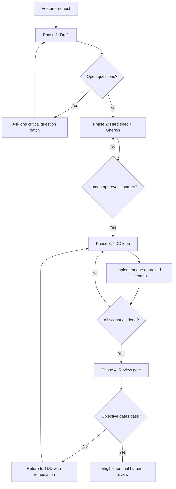

<div align="center">
  
</div>

# Rotta

`rotta` is a contract-driven workflow for coding agents. It turns a feature request into a reviewed implementation through four gates: draft clarification, hard spec + Gherkin, strict TDD, and evidence-based review.

The primary installed agent is **Rotta-Orchestrator**. It coordinates the workflow and delegates focused work to `rotta-spec`, `rotta-impl`, and `rotta-review`.

## Quick Start

```bash
brew tap Syfra3/tap
brew install rotta
rotta
```

Or install with the script:

```bash
curl -sSL https://raw.githubusercontent.com/Syfra3/Rotta/main/scripts/install-rotta.sh | bash
```

If `/usr/local/bin` is not writable:

```bash
export ROTTA_INSTALL_DIR="$HOME/.local/bin"
curl -sSL https://raw.githubusercontent.com/Syfra3/Rotta/main/scripts/install-rotta.sh | bash
```

After installing generated opencode or Claude Code config, restart the coding agent so it reloads agents, skills, and MCP permissions.

## What It Installs

| Item | Purpose |
|------|---------|
| `rotta` | Terminal installer and setup UI |
| `Rotta-Orchestrator` / `rotta-orchestrator` | Primary agent that owns phase transitions and human gates |
| `rotta-spec` | Sub-agent for hard specs and Gherkin contracts |
| `rotta-impl` | Sub-agent for one-scenario-at-a-time strict TDD |
| `rotta-review` | Sub-agent for objective quality evidence and review gates |
| `.rotta/state-machine.yaml` | Workflow phase model for installed projects |
| `.rotta/quality-gates.yaml` | Review thresholds used by the review phase |
| Ancora (optional) | Persistent memory for compact workflow state indexes and recovery pointers |
| Vela (optional) | Local graph extraction/retrieval for structural, dependency, and impact questions |

Generated files are written for the selected target:

| Target | Generated integration |
|--------|-----------------------|
| opencode | Agent entries in `~/.config/opencode/opencode.json` and skill files under `~/.config/opencode/skills/` |
| Claude Code | Skills under `~/.claude/skills/rotta/` and MCP permissions in `~/.claude/settings.json` |
| Both | Installs both integrations and the project config files |

During the TUI setup, Ancora and Vela are independent choices. You can install neither, Ancora only, Vela only, or both.

- If Ancora is skipped, generated instructions use workspace files as the only state source and do not require `ancora_*` tools.
- If Vela is skipped, generated instructions use normal code exploration and do not require `vela_*` tools.
- If Vela is enabled, generated instructions treat it as optional graph intelligence only. Rotta still controls phases, gates, and delegation.
- If both are enabled, Ancora remains the primary memory surface while Vela provides graph retrieval through available `vela_*` tools.

Vela setup initializes project graph storage but does not assume graph data is already fresh for a new codebase. Generated agents are instructed to check or trigger graph extraction before relying on Vela for dependency, impact, path, or architecture answers, and to report low-confidence or incomplete graph coverage back to the orchestrator.

## Compatible Coding Agents

`rotta` is designed for coding agents that can read instructions, delegate or invoke sub-agents, edit files, run tests, and use persistent memory when available.

It ships first-class installation paths for:

- opencode
- Claude Code

Other agents can still use the workflow by reading the generated instructions in `assets/agents/` and `assets/skills/`, then following the same phase contracts and file gates.

## Workflow Steps



| Phase | Owner | Output | Gate |
|-------|-------|--------|------|
| Draft | Rotta-Orchestrator + human | Clarified request and risk questions | No unresolved blockers |
| Spec + Gherkin | `rotta-spec` | `specs/hard_spec.md` and `features/*.feature` | Human approves the contract |
| TDD | `rotta-impl` | Tests and implementation for one scenario at a time | All approved scenarios are green |
| Review | `rotta-review` | `reports/judge_report.md` with evidence | Objective gates pass or escalate |
| Final review | Human | Merge-ready change | Semantic, design, and risk review pass |

Objective gates make agent-written code eligible for review. They do not replace final human judgment.

## Main TDD Loop

`rotta-impl` implements exactly one approved Gherkin scenario per cycle.

1. Red: write the smallest failing test for the approved `@SCN-NNN` scenario.
2. Green: write the minimum production code required to pass that test.
3. Refactor: improve names, duplication, and structure without changing behavior.
4. Record: append traceability and cycle evidence to `.rotta/tdd-log.md`.
5. Repeat: move to the next approved scenario only after the current cycle is green.

The loop protects scope. New behavior must come from an approved Gherkin scenario, not from opportunistic implementation.

## Review Gate

`rotta-review` evaluates evidence from the installed quality gates instead of doing taste-based line review. The active thresholds live in `.rotta/quality-gates.yaml`.

The review phase checks:

- Scenario-to-test traceability
- Full test suite status
- Changed-line and critical-path coverage
- Mutation testing evidence
- Architecture and dependency constraints
- Static analysis results
- Unauthorized file or scope changes

If a hard gate fails, the workflow returns to TDD with specific remediation. If the evidence passes, the change is ready for final human review.

## Development

```bash
make build
make verify
```

Useful targets:

| Command | Purpose |
|---------|---------|
| `make build` | Build `bin/rotta` |
| `make install` | Install the binary into `$GOPATH/bin` |
| `make test` | Run Go tests |
| `make lint` | Run golangci-lint |
| `make verify` | Run format check, lint, race tests, and build |
| `make hooks-install` | Install repository git hooks |

## Inspiration

The workflow is inspired by Clean Architecture fundamentals, strict test-driven development, and John Ousterhout's _A Philosophy of Software Design_. The project also carries forward the user's historical Uncle Bob reference as inspiration, but the product identity is now `Rotta`.

## License

This project is licensed under the Apache License 2.0. See [`LICENSE`](LICENSE) for details.
