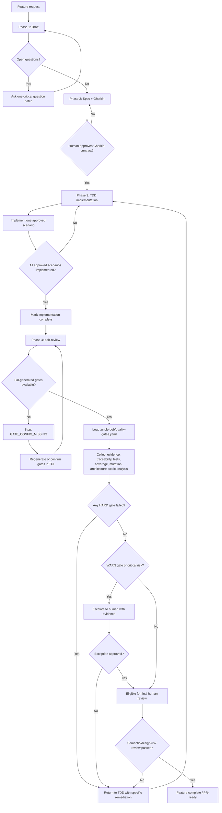

# bob-workflow

`bob-workflow` is a contract-driven development orchestrator for Uncle Bob style execution:
hard spec → Gherkin → TDD → review.

## Workflow decision map

The workflow protects reviewer time by separating contract approval, TDD
implementation, objective evidence review, and final human judgment.



### Decision points

| Step | Decision | Owner | Outcome |
|------|----------|-------|---------|
| Draft | Are there unresolved questions? | Orchestrator + human | Clarify before specs |
| Spec | Is the Gherkin contract approved? | Human | Approval unlocks TDD |
| TDD | Are all approved scenarios implemented? | `bob-impl` | Completion unlocks review |
| Review config | Are TUI-generated gates available? | `bob-review` | Missing config stops review |
| Objective gates | Did any active HARD gate fail? | `bob-review` | Failure returns to TDD |
| Risk gates | Did WARN gates or critical risks appear? | `bob-review` + human | Human exception or remediation |
| Final review | Is the work semantically correct and design-fit? | Human | Pass means PR-ready |

Objective gates make AI-generated code eligible for review. They do not replace
final human approval.

## What this repository includes

- `bin/uncle-bob` — CLI entrypoint.
- `cmd/` and `internal/` — command and application internals.
- `assets/agents/` — agent contracts that define how the workflow is delegated.

## Compatible coding agents

This project works with the following agents:

- `bob-orchestrator` (`assets/agents/bob-orchestrator.md`)
- `bob-spec` (`assets/agents/bob-spec.md`)
- `bob-impl` (`assets/agents/bob-impl.md`)
- `bob-review` (`assets/agents/bob-review.md`)

## Repository conventions

- Keep workflow state and generated helpers out of version control when possible.
- This repo ignores:
  - `.atl/`
  - `openspec/` and `.openspec/`
  - `build/` (and common generated folders like `dist/`, `tmp/`, `coverage/`)

## License

This project is licensed under the Apache License 2.0.
See the [`LICENSE`](LICENSE) file for full terms.
## Quick start

1. Initialize Go module dependencies and build as needed with standard Go tooling.
2. Run the CLI entrypoint once the binary is built.

## Installation

### Project naming in docs

This repository is published as `bob-workflow` (release artifact and Homebrew formula), while the binary name is `uncle-bob`.

If you are working in an `ancora` or `vela` context, these are companion projects in the same workflow ecosystem. Use the same install artifact and keep the local command name configured as needed:

- Default command: `uncle-bob`
- Optional override (docs variants): `BOB_WORKFLOW_BINARY_NAME=ancora` or `BOB_WORKFLOW_BINARY_NAME=vela`

### Homebrew (recommended)

```bash
brew tap Syfra3/tap
brew install bob-workflow
uncle-bob --help
```

If Homebrew supports a direct formula install path for your environment, the release repo also updates `Formula/bob-workflow.rb` in the `Syfra3/homebrew-tap` repository via CI.

### Script install (all platforms)

```bash
curl -sSL https://raw.githubusercontent.com/Syfra3/bob-workflow/main/scripts/install-bob-workflow.sh | bash
```

If your environment requires a writable `/usr/local/bin` override:

```bash
export BOB_WORKFLOW_INSTALL_DIR="$HOME/.local/bin"
curl -sSL https://raw.githubusercontent.com/Syfra3/bob-workflow/main/scripts/install-bob-workflow.sh | bash
```

Use legacy/alternative naming in docs or local scripts:

```bash
BOB_WORKFLOW_BINARY_NAME=ancora bash -c 'curl -sSL https://raw.githubusercontent.com/Syfra3/bob-workflow/main/scripts/install-bob-workflow.sh | bash'
BOB_WORKFLOW_BINARY_NAME=vela bash -c 'curl -sSL https://raw.githubusercontent.com/Syfra3/bob-workflow/main/scripts/install-bob-workflow.sh | bash'
```

### From source

```bash
cd bob-workflow
make build
make install
```

### Local quality and hooks

```bash
make verify
make hooks-install
```

`make verify` runs format check, lint, tests, and build.
`make hooks-install` installs the repository-managed git hooks (`pre-commit` and `pre-push`).
