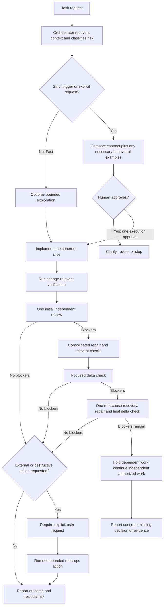

<div align="center">
  
</div>

# Rotta

`rotta` is a lightweight coding workflow for specialized agents. Fast mode delivers ordinary work through one coherent implementation slice, change-relevant verification, and an independent review. Strict mode adds a compact approved contract only for high-risk or explicitly contract-driven work.

The primary installed agent is **Rotta-Orchestrator**. It routes focused work to `rotta-explore`, `rotta-impl`, `rotta-review`, and `rotta-ops`.

## Quick Start

```bash
brew tap Syfra3/tap
brew install rotta
rotta
```

Or install with the script:

```bash
curl -sSL https://raw.githubusercontent.com/Syfra3/Rotta/main/scripts/install-rotta.sh | bash
```

If `/usr/local/bin` is not writable:

```bash
export ROTTA_INSTALL_DIR="$HOME/.local/bin"
curl -sSL https://raw.githubusercontent.com/Syfra3/Rotta/main/scripts/install-rotta.sh | bash
```

After installing generated opencode or Claude Code config, restart the coding agent so it reloads agents, skills, and MCP permissions.

## Rotta Next

Rotta Next replaces the old phase-led workflow with a lightweight default path. The practical change is that normal work no longer needs a worktree, a hard-spec artifact, Gherkin, per-scenario checkpoints, intermediate commits, or a follow-up `continue` prompt.

For a normal request, expect this sequence:

1. `rotta-orchestrator` recovers only relevant context and classifies risk.
2. It optionally asks `rotta-explore` a bounded structural question.
3. `rotta-impl` completes one coherent implementation slice and runs the relevant checks.
4. `rotta-review` independently inspects the final diff, affected code, handoff, and test evidence, returning concrete blockers together.
5. The orchestrator advances on success. If needed, it routes a consolidated repair and focused delta check, then at most one root-cause recovery and final delta check.
6. It reports delivered outcomes and limitations. Unresolved blockers hold only dependent work; independent authorized work can continue.

The workflow asks the human only for a material product decision, missing requirements, a Strict-mode approval, credentials, or an external or destructive operation. Passing review never authorizes a commit, push, release, graph index, or cleanup action.


```mermaid
flowchart TD
    request[Task request] --> classify[Orchestrator recovers context and classifies risk]
    classify --> strict{Strict trigger or explicit request?}

    strict -- No: Fast --> explore[Optional bounded exploration]
    explore --> implement[Implement one coherent slice]

    strict -- Yes --> contract[Compact contract plus any necessary behavioral examples]
    contract --> approval{Human approves?}
    approval -- No --> clarify[Clarify, revise, or stop]
    approval -- Yes: one execution approval --> implement

    implement --> verify[Run change-relevant verification]
    verify --> review[One initial independent review]
    review -- No blockers --> operation{External or destructive action requested?}
    review -- Blockers --> repair[Consolidated repair and relevant checks]
    repair --> delta[Focused delta check]
    delta -- No blockers --> operation
    delta -- Blockers --> recovery[One root-cause recovery, repair and final delta check]
    recovery -- No blockers --> operation
    recovery -- Blockers remain --> partial[Hold dependent work; continue independent authorized work]
    partial --> decision[Report concrete missing decision or evidence]
    operation -- No --> report[Report outcome and residual risk]
    operation -- Yes --> consent[Require explicit user request]
    consent --> ops[Run one bounded rotta-ops action]
    ops --> report
```

## Roles And Installation

| Item | Purpose |
|------|---------|
| `rotta` | Terminal installer and setup UI |
| `rotta-orchestrator` | Primary router for risk, task capsules, delegation, and compact outcomes |
| `rotta-explore` | Bounded read-only discovery, including optional graph evidence |
| `rotta-impl` | One coherent implementation slice with focused verification |
| `rotta-review` | Independent diff and evidence review |
| `rotta-ops` | One explicit, bounded operational action such as an approved graph index or publication step |
| `rotta-core` | Shared safety, routing, capsule, and evidence policy |
| Ancora (optional) | Non-authoritative compact context continuity; workspace and Git remain authoritative |
| Vela (optional) | Bounded advisory structural evidence; indexing is an explicit `rotta-ops` action |

Generated files are written for the selected target:

| Target | Generated integration |
|--------|-----------------------|
| OpenCode | Agent entries in `~/.config/opencode/opencode.json` and skills under `~/.config/opencode/skills/rotta-next/` |
| Claude Code | Role agents under `~/.claude/agents/` and skills under `~/.claude/skills/rotta-next/` |
| Codex | Adapted instructions in `~/.codex/AGENTS.md` |
| Both or all | Installs the selected host integrations |

All core and role files are tracked in `~/.config/rotta/managed-artifacts.json` with SHA-256 digests. Reinstalling updates only Rotta-owned, unmodified files. Installation rejects unowned, modified, malformed, or symlinked managed targets instead of silently overwriting them.

OpenCode prompts and installed skills explicitly read the core and role from the same absolute bundle under the effective `XDG_CONFIG_HOME` (or `~/.config`). They do not resolve `rotta-core` by name, avoiding stale same-named skills under `~/.claude/` or other discovery paths. Exact legacy prompts are upgraded only with intact managed-role ownership evidence. Custom prompts are preserved; setup reports degraded `source_loading` with a concrete remediation when their loader cannot be established. This reports generated configuration, not proof of live host behavior: overlays and read permissions can still intervene. Restart OpenCode and verify the actual loaded paths after installing. Duplicate custom/other-host skills are not deleted.

Claude agents explicitly read their matching `.claude/skills/rotta-next/` bundle. Codex uses the core and role sections embedded in its generated `.codex/AGENTS.md`, without searching for external skills. User-specified model and delegation constraints still apply.

During setup, Ancora and Vela are independent choices.

- If Ancora is enabled, agents recover concise relevant context and save compact decisions, discoveries, and end summaries. An Ancora failure is a warning, not a workflow failure.
- If Ancora is skipped, agents work from the current workspace and Git state without calling `ancora_*` tools.
- If Vela is enabled, agents may use it only for a named structural question, with a small call budget and source fallback.
- Rotta does not install, index, refresh, or otherwise mutate Vela graph state during setup. Request a bounded `rotta-ops` action and explicitly consent when indexing is needed.

Every delegated role receives a compact task capsule: objective, acceptance checks, declared scope, non-goals, baseline, relevant facts, verification commands, and expected result format. This prevents each role from re-reading the complete workflow or inventing scope.

## Compatible Coding Agents

`rotta` is designed for coding agents that can read instructions, delegate or invoke sub-agents, edit files, run tests, and use persistent memory when available.

It ships first-class installation paths for:

- opencode
- Claude Code

Other agents can use the same policy by reading `assets/core/rotta-core.md` and the matching role prompt under `assets/agents/`.

## Workflow Modes

Fast mode is the default. It recovers relevant context, classifies risk, optionally explores, implements one coherent slice, runs change-relevant checks, independently reviews the result, and reports the outcome. It does not require a worktree, lifecycle ledger, hard-spec artifact, mandatory Gherkin, intermediate commit, full repository suite, or `continue` prompt.

Strict mode applies to security, authentication, payments, migrations, destructive operations, public contracts, high-impact multi-component changes, or an explicit request. Before implementation, Rotta writes a compact contract under `.rotta/strict/` and obtains one explicit approval. A documented user exception may allow Fast mode.

Gherkin is optional in Strict mode. Rotta uses it only when UI state transitions, validation, authorization, destructive confirmation, accessibility behavior, public interfaces, or workflow examples need observable examples to make approval unambiguous. Documentation, formatting, dependency remediation, behavior-preserving refactors, and cosmetic UI changes do not need it by default.

When needed, examples and contract are approved together. An implementation request plus one approved execution scope covers its ordinary internal slices: decomposition does not create another spec/review/approval hierarchy. Material changes to acceptance, invariants, scope or operational effect need a narrow amendment; routine in-scope fixes do not. Existing application contracts with explicit child approvals remain binding until the user changes them. A specification-only request ends with the specification.

### Review that converges

- **Blocker:** a violated requirement or concrete correctness/security invariant, supported by causal evidence, material impact and an in-scope correction.
- **Advisory:** preferences, speculative hardening or unrelated existing issues without a demonstrated material violation. Recommendations cannot invent approval gates.
- **Evidence gap:** blocks only when material required behavior cannot be established by current evidence.

One initial review is followed, when necessary, by one consolidated repair/delta check and one autonomous root-cause recovery/final delta check. Delta checks focus on finding closure and repair-induced regressions. Reopening unchanged accepted scope requires new material evidence. A pass advances automatically; a counter alone does not trigger a generic “continue?” question. If the final check still finds real blockers, preserve work, continue independent authorized work and explain the concrete decision or missing evidence. Never hide a defect to fit the budget. Renaming tasks or resuming agents does not reset review history.

These are agent-turn policies, **not a runtime-enforced state machine**. Installer tests verify generated loaders and ownership behavior; policy/evaluation evidence must distinguish simulated decisions from live workflow execution. No percentage speedup is claimed without comparable measured tasks.

## What To Expect

- The default interaction is shorter and more autonomous, but it still ends with a fresh review.
- Verification is proportional: changed behavior gets focused checks first; expensive full-suite, coverage, static-analysis, or audit runs happen only when policy, risk, evidence, or the user requires them.
- Review findings are concrete and ordered by severity. If there are no findings, the review states that and names residual testing gaps.
- User-facing reports lead with delivered outcomes, checks and material limitations. Detailed mode/role/decision/timing/retry records stay compact in session evidence and can be expanded on request. Missing optional metrics do not block work.
- Historical v2-only tests remain available behind the `legacy_v2` Go build tag. Default `go test ./...` validates the active Rotta Next installer, CLI, and TUI behavior.

## Development

```bash
make build
make verify
```

Useful targets:

| Command | Purpose |
|---------|---------|
| `make build` | Build `bin/rotta` |
| `make install` | Install the binary into `$GOPATH/bin` |
| `make test` | Run Go tests |
| `make lint` | Run golangci-lint |
| `make verify` | Run format check, lint, race tests, and build |
| `make hooks-install` | Install repository git hooks |

## Inspiration

The workflow is inspired by Clean Architecture fundamentals, strict test-driven development, and John Ousterhout's _A Philosophy of Software Design_. The project also carries forward the user's historical Uncle Bob reference as inspiration, but the product identity is now `Rotta`.

## License

This project is licensed under the Apache License 2.0. See [`LICENSE`](LICENSE) for details.
