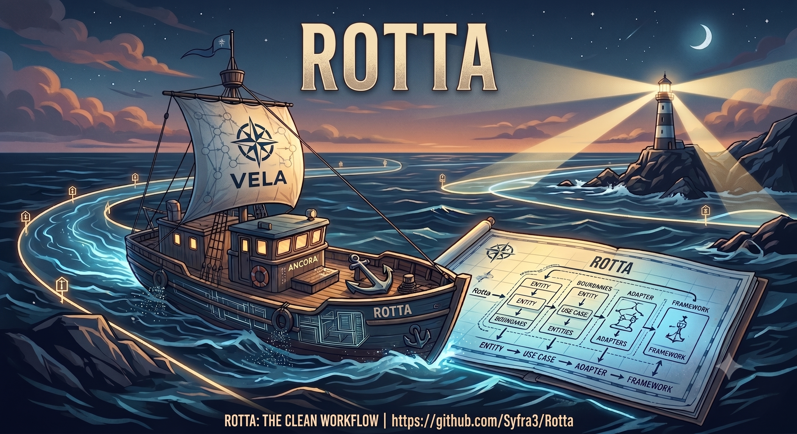

<div align="center">
  
</div>

# Rotta

`rotta` is a lightweight coding workflow for specialized agents. Fast mode delivers ordinary work through one coherent implementation slice, change-relevant verification, and an independent review. Strict mode adds a compact approved contract only for high-risk or explicitly contract-driven work.

The primary installed agent is **Rotta-Orchestrator**. It routes focused work to `rotta-explore`, `rotta-impl`, `rotta-review`, and `rotta-ops`.

## Quick Start

```bash
brew tap Syfra3/tap
brew install rotta
rotta
```

Or install with the script:

```bash
curl -sSL https://raw.githubusercontent.com/Syfra3/Rotta/main/scripts/install-rotta.sh | bash
```

If `/usr/local/bin` is not writable:

```bash
export ROTTA_INSTALL_DIR="$HOME/.local/bin"
curl -sSL https://raw.githubusercontent.com/Syfra3/Rotta/main/scripts/install-rotta.sh | bash
```

After installing generated opencode or Claude Code config, restart the coding agent so it reloads agents, skills, and MCP permissions.

## What It Installs

| Item | Purpose |
|------|---------|
| `rotta` | Terminal installer and setup UI |
| `rotta-orchestrator` | Primary router for risk, capsules, and compact outcomes |
| `rotta-explore` | Bounded read-only discovery, including optional graph evidence |
| `rotta-impl` | One coherent implementation slice with focused verification |
| `rotta-review` | Independent diff and evidence review |
| `rotta-ops` | One explicit operational action |
| `rotta-core` | Shared safety, routing, capsule, and evidence policy |
| Ancora (optional) | Non-authoritative compact context continuity |
| Vela (optional) | Bounded advisory structural evidence; indexing needs explicit consent |

Generated files are written for the selected target:

| Target | Generated integration |
|--------|-----------------------|
| opencode | Agent entries in `~/.config/opencode/opencode.json` and skill files under `~/.config/opencode/skills/` |
| Claude Code | Skills under `~/.claude/skills/rotta/` and MCP permissions in `~/.claude/settings.json` |
| Both | Installs both integrations and the project config files |

During the TUI setup, Ancora and Vela are independent choices. You can install neither, Ancora only, Vela only, or both.

- If Ancora is skipped, generated instructions use workspace files as the only state source and do not require `ancora_*` tools.
- If Vela is skipped, generated instructions use normal code exploration and do not require `vela_*` tools.
- If Vela is enabled, generated instructions treat it as optional graph intelligence only. Rotta still controls phases, gates, and delegation.
- If both are enabled, Ancora remains the primary memory surface while Vela provides graph retrieval through available `vela_*` tools.

Vela setup initializes project graph storage but does not assume graph data is already fresh for a new codebase. Generated agents are instructed to check or trigger graph extraction before relying on Vela for dependency, impact, path, or architecture answers, and to report low-confidence or incomplete graph coverage back to the orchestrator.

## Compatible Coding Agents

`rotta` is designed for coding agents that can read instructions, delegate or invoke sub-agents, edit files, run tests, and use persistent memory when available.

It ships first-class installation paths for:

- opencode
- Claude Code

Other agents can still use the workflow by reading the generated instructions in `assets/agents/` and `assets/skills/`, then following the same phase contracts and file gates.

## Workflow Modes

Fast mode is the default: recover relevant context, classify risk, optionally explore, implement one coherent slice, run relevant checks, independently review, and report. It does not require a worktree, lifecycle ledger, hard-spec artifact, mandatory Gherkin, intermediate commit, or `continue` prompt.

Strict mode applies to security, authentication, payments, migrations, destructive operations, public contracts, high-impact multi-component changes, or an explicit request. It records a compact contract under `.rotta/strict/` and requires approval before implementation. Gherkin is used only when observable examples are material to an unambiguous behavioral contract.

Every subagent receives a compact capsule with objective, acceptance checks, scope, non-goals, baseline, relevant facts, verification commands, and expected result format. The reviewer receives the final diff, affected code, implementation handoff, and test evidence, then reports concrete findings in severity order.

## Development

```bash
make build
make verify
```

Useful targets:

| Command | Purpose |
|---------|---------|
| `make build` | Build `bin/rotta` |
| `make install` | Install the binary into `$GOPATH/bin` |
| `make test` | Run Go tests |
| `make lint` | Run golangci-lint |
| `make verify` | Run format check, lint, race tests, and build |
| `make hooks-install` | Install repository git hooks |

## Inspiration

The workflow is inspired by Clean Architecture fundamentals, strict test-driven development, and John Ousterhout's _A Philosophy of Software Design_. The project also carries forward the user's historical Uncle Bob reference as inspiration, but the product identity is now `Rotta`.

## License

This project is licensed under the Apache License 2.0. See [`LICENSE`](LICENSE) for details.
