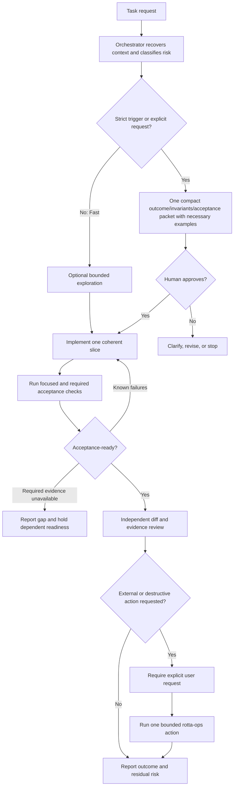

<div align="center">
  
</div>

# Rotta

`rotta` is a lightweight coding workflow for specialized agents. Fast mode delivers ordinary work through one coherent implementation slice, change-relevant verification, and an independent review. Strict mode adds a compact approved contract only for high-risk or explicitly contract-driven work.

The primary installed agent is **Rotta-Orchestrator**. It routes focused work to `rotta-explore`, `rotta-impl`, `rotta-review`, and `rotta-ops`.

## Quick Start

```bash
brew tap Syfra3/tap
brew install rotta
rotta
```

Or install with the script:

```bash
curl -sSL https://raw.githubusercontent.com/Syfra3/Rotta/main/scripts/install-rotta.sh | bash
```

If `/usr/local/bin` is not writable:

```bash
export ROTTA_INSTALL_DIR="$HOME/.local/bin"
curl -sSL https://raw.githubusercontent.com/Syfra3/Rotta/main/scripts/install-rotta.sh | bash
```

After installing generated opencode or Claude Code config, restart the coding agent so it reloads agents, skills, and MCP permissions.

## Rotta Next

Rotta Next replaces the old phase-led workflow with a lightweight default path. The practical change is that normal work no longer needs a worktree, a hard-spec artifact, Gherkin, per-scenario checkpoints, intermediate commits, or a follow-up `continue` prompt.

For a normal request, expect this sequence:

1. `rotta-orchestrator` recovers only relevant context and classifies risk.
2. It optionally asks `rotta-explore` a bounded structural question.
3. `rotta-impl` completes one coherent implementation slice and supplies reproducible acceptance results. Known acceptance failures route back to correction even when focused tests pass.
4. Once acceptance-ready, `rotta-review` independently inspects the final diff, affected code, handoff, and test evidence.
5. The orchestrator reports results, unresolved risk, and the next safe action.

The workflow asks the human only for a material product decision, missing requirements, a Strict-mode approval, credentials, or an external or destructive operation. Passing review never authorizes a commit, push, release, graph index, or cleanup action.


```mermaid
flowchart TD
    request[Task request] --> classify[Orchestrator recovers context and classifies risk]
    classify --> strict{Strict trigger or explicit request?}

    strict -- No: Fast --> explore[Optional bounded exploration]
    explore --> implement[Implement one coherent slice]

    strict -- Yes --> contract[One compact outcome/invariants/acceptance packet with necessary examples]
    contract --> approval{Human approves?}
    approval -- No --> clarify[Clarify, revise, or stop]
    approval -- Yes --> implement

    implement --> verify[Run focused and required acceptance checks]
    verify --> ready{Acceptance-ready?}
    ready -- Known failures --> implement
    ready -- Required evidence unavailable --> gap[Report gap and hold dependent readiness]
    ready -- Yes --> review[Independent diff and evidence review]
    review --> operation{External or destructive action requested?}
    operation -- No --> report[Report outcome and residual risk]
    operation -- Yes --> consent[Require explicit user request]
    consent --> ops[Run one bounded rotta-ops action]
    ops --> report
```

## Roles And Installation

| Item | Purpose |
|------|---------|
| `rotta` | Terminal installer and setup UI |
| `rotta-orchestrator` | Primary router for risk, task capsules, delegation, and compact outcomes |
| `rotta-explore` | Bounded read-only discovery, including optional graph evidence |
| `rotta-impl` | One coherent implementation slice with focused verification |
| `rotta-review` | Independent diff and evidence review |
| `rotta-ops` | One explicit, bounded operational action such as an approved graph index or publication step |
| `rotta-core` | Shared safety, routing, capsule, and evidence policy |
| Ancora (optional) | Non-authoritative compact context continuity; workspace and Git remain authoritative |
| Vela (optional) | Bounded advisory structural evidence; indexing is an explicit `rotta-ops` action |

Generated files are written for the selected target:

| Target | Generated integration |
|--------|-----------------------|
| OpenCode | Agent entries in `~/.config/opencode/opencode.json` and skills under `~/.config/opencode/skills/rotta-next/` |
| Claude Code | Role agents under `~/.claude/agents/` and skills under `~/.claude/skills/rotta-next/` |
| Codex | Adapted instructions in `~/.codex/AGENTS.md` |
| Both or all | Installs the selected host integrations |

All core and role files are tracked in `~/.config/rotta/managed-artifacts.json` with SHA-256 digests. Reinstalling updates only Rotta-owned, unmodified files. Installation rejects unowned, modified, malformed, or symlinked managed targets instead of silently overwriting them.

During setup, Ancora and Vela are independent choices.

- If Ancora is enabled, agents recover concise relevant context and save compact decisions, discoveries, and end summaries. An Ancora failure is a warning, not a workflow failure.
- If Ancora is skipped, agents work from the current workspace and Git state without calling `ancora_*` tools.
- If Vela is enabled, agents may use it only for a named structural question, with a small call budget and source fallback.
- Rotta does not install, index, refresh, or otherwise mutate Vela graph state during setup. Request a bounded `rotta-ops` action and explicitly consent when indexing is needed.

Every delegated role receives a compact task capsule: objective, acceptance checks, declared scope, non-goals, baseline, relevant facts, verification commands, and expected result format. This prevents each role from re-reading the complete workflow or inventing scope.

## Compatible Coding Agents

`rotta` is designed for coding agents that can read instructions, delegate or invoke sub-agents, edit files, run tests, and use persistent memory when available.

It ships first-class installation paths for:

- opencode
- Claude Code

Other agents can use the same policy by reading `assets/core/rotta-core.md` and the matching role prompt under `assets/agents/`.

## Workflow Modes

Fast mode is the default. It recovers relevant context, classifies risk, optionally explores, implements one coherent slice, runs change-relevant checks, independently reviews the result, and reports the outcome. It does not require a worktree, lifecycle ledger, hard-spec artifact, mandatory Gherkin, intermediate commit, full repository suite, or `continue` prompt.

Strict mode applies to security, authentication, payments, migrations, destructive operations, public contracts, high-impact multi-component changes, or an explicit request. Before implementation, Rotta writes a compact contract under `.rotta/strict/` and obtains one explicit approval. A documented user exception may allow Fast mode.

Gherkin is optional in Strict mode. Rotta uses it only when UI state transitions, validation, authorization, destructive confirmation, accessibility behavior, public interfaces, or workflow examples need observable examples to make approval unambiguous. Documentation, formatting, dependency remediation, behavior-preserving refactors, and cosmetic UI changes do not need it by default.

Strict combines outcome, scope, invariants, acceptance checks and necessary examples in **one approval packet**. It does not automatically run independent contract reviews or equivalent child approvals. Material ambiguity goes directly to the user. Internal tasks and ordinary corrections reuse the approved scope.

### Work continuity and delivery

The orchestrator owns one stable local work record across agents, resumes and renames, using existing durable project/session records or `.rotta/work/<work-id>.md`. It retains approved scope and approval evidence references, outstanding acceptance findings, cumulative review/recovery counts, passed checks and next action. Children read its ID/revision and return deltas; the orchestrator re-reads, checks revision, merges and reads back updates. Fast does not need a legacy worktree or feature manifest. Ancora is an optional advisory summary; stale memory cannot authorize work.

Tasks describe a user-visible capability. Foundation tasks explain the dependency they unlock and the next integration action. Reports distinguish **implemented** (exists), **integrated** (connected to its consumer), **verified** (required checks pass), and **delivered** (the agreed user-visible outcome is usable). Completing a domain layer or document does not deliver an entire feature.

These rules ship as core/role instructions consumed through the existing installer. The generated OpenCode orchestrator has file tools enabled for workflow records/approval packets by policy; those tools are not a host-enforced path sandbox. Single-writer/revision checks are agent-turn instructions, not atomic locking. The legacy Go `feature_progress.go` and advisory `ancora_state.go` helpers are not Next agent persistence hooks. Regression tests verify policy content and actual temporary-home installation/tool wiring; they do not prove live-agent compliance or runtime workflow transitions. Existing modified installations require deliberate reconciliation; changing this repository alone does not update a running host.

**Upgrading an older OpenCode installation:** even an untouched older generated orchestrator can retain `tools.edit: false` and `tools.write: false`. New defaults apply to absent agent entries; the installer preserves existing agent settings rather than guessing ownership. Installation and no-op reruns report a reconciliation warning with the resolved config path and each explicitly disabled file tool. Reconcile those settings and applicable permissions for workflow-record access, then restart OpenCode. Bash can stay disabled. Until reconciled, refreshed policy files alone do not make local work-record persistence usable. Custom prompts, tools and unrelated configuration are preserved.

## What To Expect

- The default interaction is shorter and more autonomous, but it still ends with a fresh review.
- Verification is proportional: changed behavior gets focused checks first; expensive full-suite, coverage, static-analysis, or audit runs happen only when policy, risk, evidence, or the user requires them.
- Review findings are concrete and ordered by severity. If there are no findings, the review states that and names residual testing gaps.
- Outcome reports include the selected mode, invoked roles, requested human decisions, tests run, review result, unresolved risk, elapsed active time, child sessions, and retries.
- Historical v2-only tests remain available behind the `legacy_v2` Go build tag. Default `go test ./...` validates the active Rotta Next installer, CLI, and TUI behavior.

## Development

```bash
make build
make verify
```

Useful targets:

| Command | Purpose |
|---------|---------|
| `make build` | Build `bin/rotta` |
| `make install` | Install the binary into `$GOPATH/bin` |
| `make test` | Run Go tests |
| `make lint` | Run golangci-lint |
| `make verify` | Run format check, lint, race tests, and build |
| `make hooks-install` | Install repository git hooks |

## Inspiration

The workflow is inspired by Clean Architecture fundamentals, strict test-driven development, and John Ousterhout's _A Philosophy of Software Design_. The project also carries forward the user's historical Uncle Bob reference as inspiration, but the product identity is now `Rotta`.

## License

This project is licensed under the Apache License 2.0. See [`LICENSE`](LICENSE) for details.
